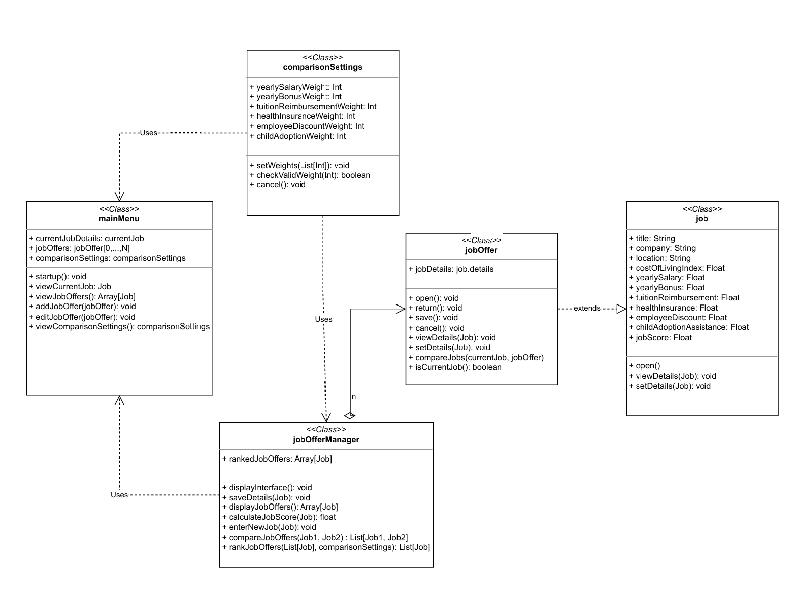

# Individual Design Discussion  

## Design 1 (dhematillake3)  
We discussed that this design handled the abstraction of the job details well, and the use of the `jobOfferManager` aligned with Tom's design. We all aligned on the use of a `mainMenu`, `comparisonSettings`, and some sort of `job` class to store details.  

We agreed to take parts of this design and modify the `currentJob` to be based on a boolean while adjusting some of the relationships. Some functions that were in `mainMenu` were moved to `jobOfferManager`.  

  

## Design 2 (lli681) 
- Pros:
  - The JobOffer class includes methods to calculate adjusted salaries and bonuses, which adds more functionality to job offers themselves.
  - This design has a Weight class with well-defined attributes and functions (addWeight, editWeight, sumWeight). This keeps weight-related functionality modular. The team design uses comparisonSettings, but it focuses on validating weights rather than directly modifying them.
  - Overall this design is concise and effectively covers all required functionalities while maintaining a modular and structured approach.  

- Cons:
  - While having a separate Result class is good for clarity, it might not be necessary if the comparison output can be stored within JobOffer or Comparator directly. The team design does not have a separate Result class, which simplifies the structure.
  - The team design introduces JobOfferManager for managing job-related operations such as ranking and comparing multiple jobs, which centralizes job-related functions. This design distributes these responsibilities across multiple classes (Comparator, JobOffer), which might make it harder to manage job offers at a higher level.

## Design 3 (mliu38) 
While having simialr design, the JobOffers class can simply be extended from JobDetails class with additional method in my original design. Team members helped provide this valuable feedback to simplify my design. The JobDetails class was also discussed to add one additional attribute: "currentJob" to distinguish current job from other available job offers, which also made the design more concise and easy to manage. 
The JobComparison class does include vital methods in calculating existing JobOffers score and are ranked descendingly to allow user to select and compare with the current job offer and is used in finalized team design. 

## Design 4 (mvillegas34)  

The pros of this design are that it is concise and does not contain unnecessary classes that could be simplified. The cons are that it does not include a `jobOfferManager` class, which we have decided as a team is necessary for our final design. Additionally, the arrows pointing toward `JobDetails` do not properly represent the intended relationships.  

  

This design shares many similarities with the others. Many of our shared ideas were incorporated into our final team design.  

# Team Design  

Aligning with the team, the following design was produced.  

  

There were many similarities in this design to others in the team, such as `mainMenu`, `comparisonSettings`, a `job` class, and a method to compare jobs.  

This design incorporates commonalities while aligning connections and leveraging the strengths of other designs. We structured each new screen as a module to abstract details effectively, focus on object-oriented design, and enable simple storage of multiple job offers.  

# Summary 
Throughout the design discussion process, our team gained valuable insights into both design principles and collaboration. From a design perspective, we recognized the importance of modularity and abstraction, as seen in the decision to centralize job-related operations in the JobOfferManager class. One key takeaway was the importance of balancing clarity and simplicity—while some designs introduced additional classes like Result, we opted for a more consolidated structure to avoid overcomplication.

From a teamwork perspective, the process really underscored the value of bringing together diverse viewpoints. By evaluating pros and cons of each design, we were able to synthesize the best ideas into a cohesive final design.

