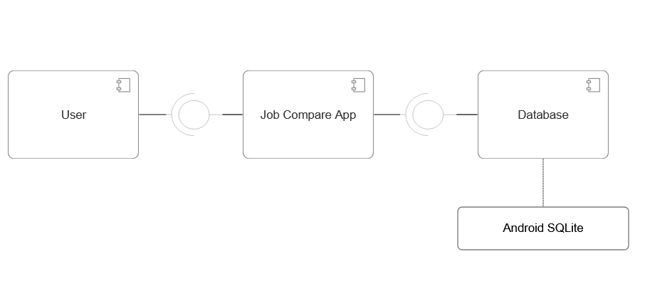
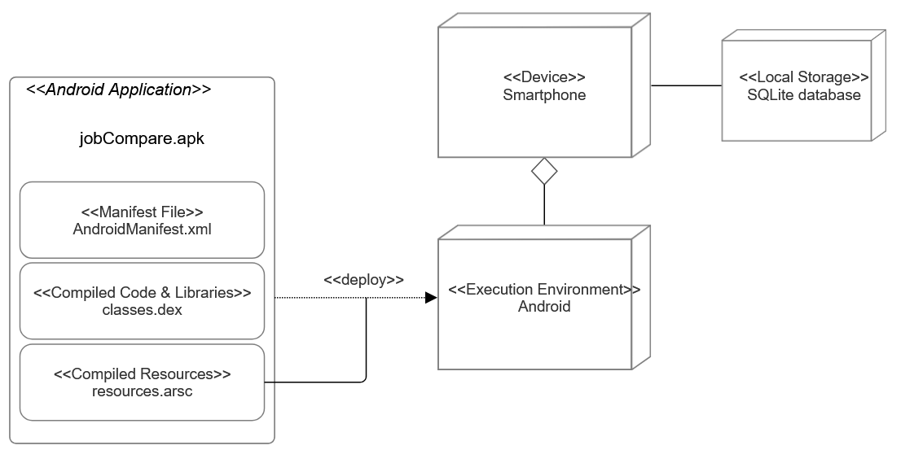
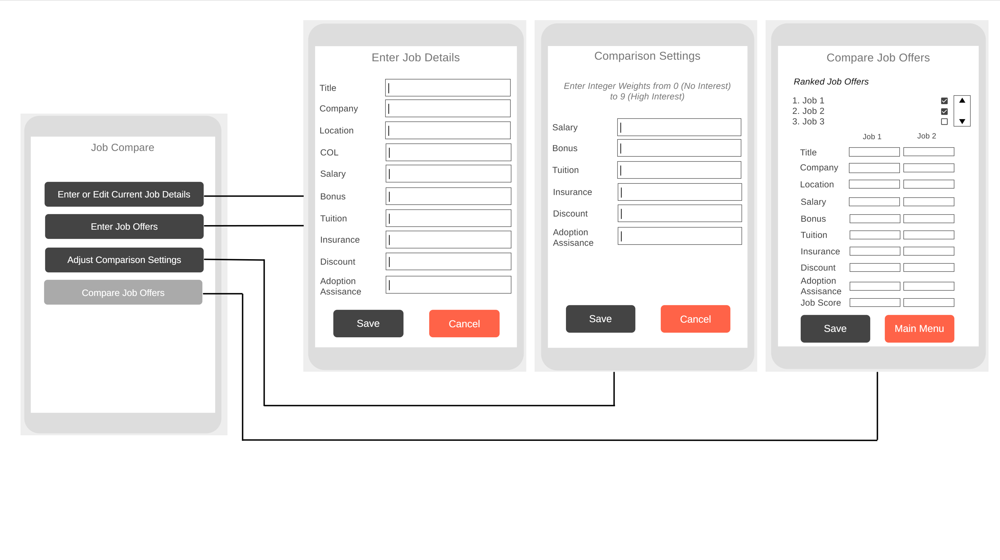

# Design Document

**Author**: Team097

## 1 Design Considerations

### 1.1 Assumptions
- The app is designed for a single user and does not require online synchronization or multi-device access.
- Users will manually enter job details and job offers; there is no integration with external job listing services.
- The user is expected to understand how job benefits impact their decision and can assign appropriate weights accordingly.
- The application requires the devices to have sufficient storage for SQLite database operations in order to keep user's setting persist between usages. 

### 1.2 Constraints
- Platform Constraint: The app is developed for Android devices using Java in Android Studio. No iOS or web versions are planned.
- Persistence Constraint: SQLite is used for storing job offers and user settings; external cloud databases are not used.
- Processing Constraint: All computations (job score ranking) will be performed locally on the device.
- Data Storage Constraint: May need to set a limit on how may job offers can be entered and stored. 

### 1.3 System Environment
- Hardware:
  - The app will run on Android smartphones and tablets with sufficient processing power and storage to handle SQLite database operations.
- Software:
  - Android Studio 
  - SDK Version 34
  - Java 17 for both Source Compatibility and Target Compatibility
  - SQLite with SQLiteOpenHelper for data storage

## 2 Architectural Design

### 2.1 Component Diagram

The component diagram proposed is as follows:

This diagram describes the main components for the app usage.

### 2.2 Deployment Diagram

The deployment diagram proposed is as follows:

This diagram describes the deployment of the app with all the physical components considered.

## 3 Low-Level Design

### 3.1 Class Diagram
The class diagram we proposed is:

This diagram captures the main classes we want for functionality.

## 4 User Interface Design
The UI proposed is as follows:

This represents our proposed layout for the Main Menu and it's interactions with key functionalities such as entering job details, comparing jobs and entering weights in comparison settings.
