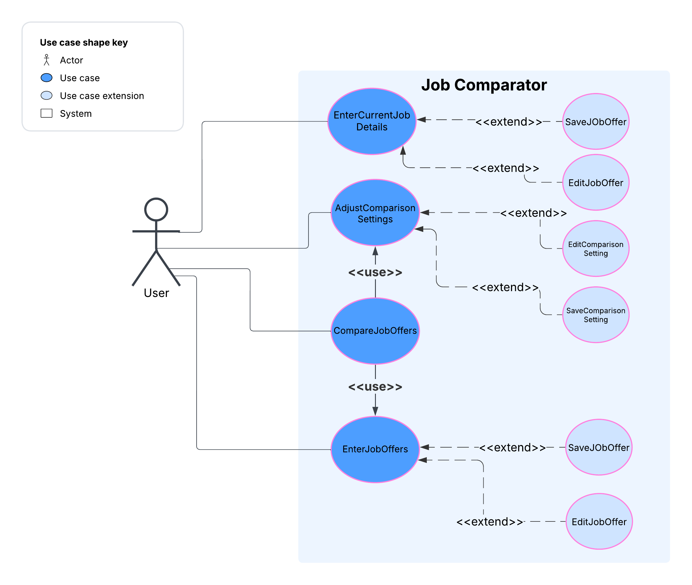

# Use Case Model

**Author**: Team097

## 1 Use Case Diagram

## 2 Use Case Descriptions

### Enter Current Job Details
- Requirements: App must allow the user to enter, edit, and save curretn job offer details.
- Pre-conditions:
  - The main menu must be accessible.
- Post-conditions:
  - Current job offer details are updated and stored.
- Scenarios:
  - User selects "Enter or Edit Current Job Details" from the main menu.
  - App displays a form to enter current job details.
  - User enters current job details.
  - User selects "Save" to store the current job details.
    - App confirms that the current job details have been saved.
    - Automatically return to the main menu
  - If the user selects "Cancel," the App discards changes and returns to the main menu.

### Enter Job Offers
- Requirements: App must allow the user to enter, edit, and save job offers.
- Pre-conditions:
  - The main menu must be accessible.
- Post-conditions:
  - Job offer is updated and stored.
  - User can choose to compare job offers or return to the main menu.
- Scenarios:
  - User selects "Enter Job Offer" from the main menu.
  - App displays a form to enter job offer details.
  - User enters job offer details.
  - User selects "Save" to store the job offer.
    - App confirms that the job offer has been saved.
    - User is given the option to enter another offer, return to the main menu, or compare the offer (if they saved it) with the current job details (if present).
  - If the user selects "Cancel," the App discards changes and returns to the main menu.

### Adjust Comparison Settings
- Requirements: The App must allow users to adjust weightings for various job factors.
- Pre-conditions:
  - The main menu must be accessible.
- Post-conditions:
  - Weight values are updated and saved.
- Scenarios:
  - User selects "Adjust Comparison Settings" from the main menu.
  - App displays current weight settings for job factors (default to equal weights).
  - User modifies the integer weight values for salary, bonus, tuition reimbursement, etc.
  - User selects "Save" to apply changes.
  - App confirms the changes and returns to the main menu.
  - If the user selects "Cancel," the App discards changes and returns to the main menu.

### Compare Job Offers
- Requirements: The App must allow the user to compare job offers based on adjusted yearly salary, benefits, and weighted factors.
- Pre-conditions:
  - The main menu must be accessible.
  - At least one job offer must be entered to compare.
  - The user must have current job details entered (if available).
- Post-conditions:
  - A comparison table is displayed.
  - User can select another comparison or return to the main menu
- Scenarios:
  - User selects "Compare Job Offers" from the main menu.
  - App displays a list of job offers ranked from best to worst (including current job).
  - User selects two jobs for comparison.
  - App calculates job scores and displays a side-by-side comparison table
  - User reviews the comparison and chooses to compare other offers or return to the main menu.

 

